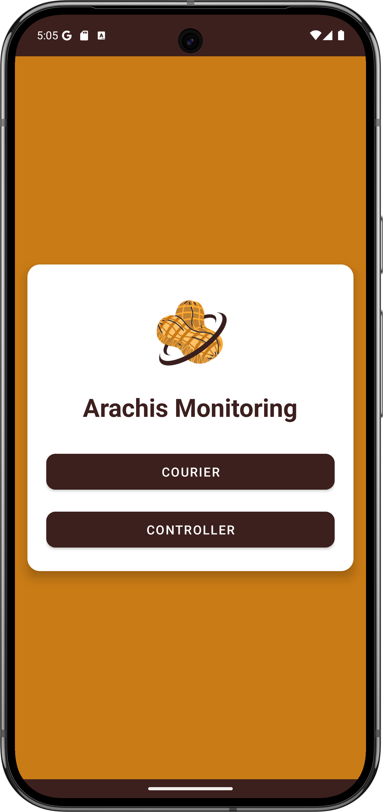
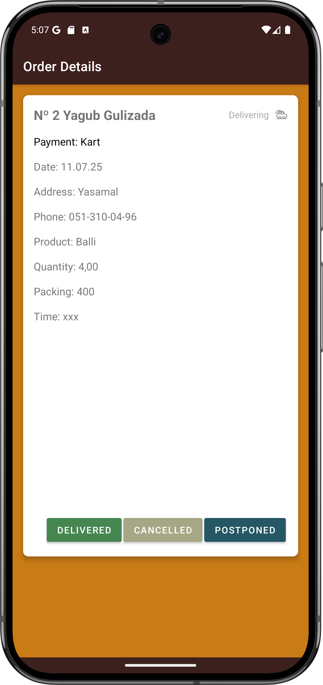

# Arachis Monitoring (OrderTracker)

Arachis Monitoring (OrderTracker) is a modern Android application designed for efficient order and delivery management. The app integrates with Google Sheets for real-time data synchronization and supports both Courier and Controller roles, making it ideal for businesses that need to track, update, and analyze delivery operations.

## Features
- **Order Tracking and Management:** View, update, and manage orders seamlessly.
- **Courier and Controller Roles:** Separate interfaces and permissions for couriers and controllers.
- **Google Sheets Integration:** Real-time data sync with Google Sheets for easy access and backup.
- **Modern, User-Friendly UI:** Clean and intuitive design for a smooth user experience.
- **Order Status Updates:** Mark orders as delivered, cancelled, or postponed with notes.
- **Business Analytics:** Controllers can view detailed order and income statistics.

## Getting Started
1. **Clone the repository:**
   ```sh
   git clone https://github.com/Yagubbb/OrderTracker.git
   ```
2. **Set up your Google Sheet:**
   - Create a Google Sheet and share it with the Google account you will use in the app.
   - Copy the Sheet ID from the URL.
3. **Configure local properties:**
   - Copy `local.properties.example` to `local.properties` in the project root.
   - Add your Google Sheet ID:
     ```
     SHEET_ID=your_actual_sheet_id_here
     ```
4. **Open the project in Android Studio.**
5. **Build and run the app** on your device or emulator.

## Screenshots

### 1. Welcome Screen


### 2. Orders List


### 3. Order Details


### 4. Confirmation Dialog

